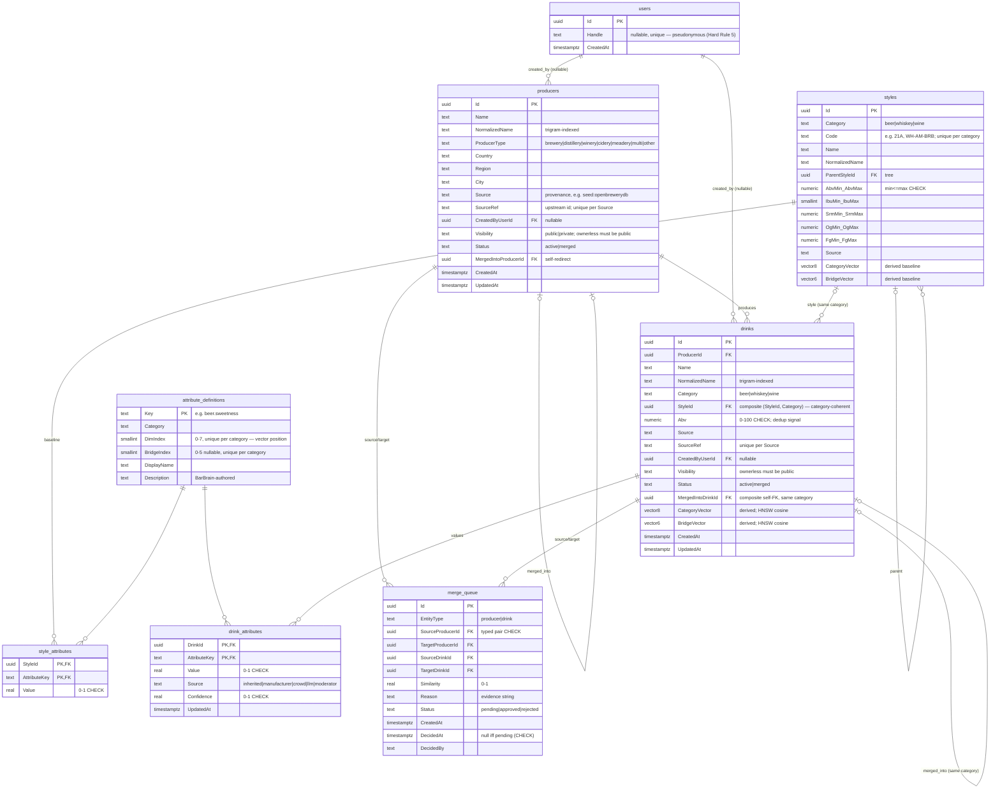

# SCHEMA — Sprint 1 catalog (Gate A review artifact)

The expensive-to-reverse decisions live here. Everything below ships in
migration `20260706213453_Sprint1Catalog` on top of Sprint 0's
`InitialCreate` (settings, events). Column names are PascalCase (EF
convention, matching Sprint 0); table names snake_case.

## ERD

## Why it looks this way

- **Canonical drink = (producer, product, category)** (ADR-008), enforced by
  the partial unique index `ux_drinks_canonical_identity` on
  `(ProducerId, Category, NormalizedName) WHERE Status='active'` — merged
  redirects keep their name without blocking the survivor. Package format,
  vintage, ABV are metadata, not identity.
- **Licensing-safe styles (ADR-023 / decision A):** name + code + numeric
  ranges only. There is NO description column — deliberately. Rich text later
  = one additive migration, only under permission. Attribute baselines
  (`style_attributes`) are BarBrain-original editorial data.
- **Vector geometry (ADR-009/025 / decision C):** `attribute_definitions`
  pins each of the 8 per-category dims to a stable `DimIndex` (vector
  position) and maps 6 of them to the cross-category bridge via `BridgeIndex`
  (0 sweetness, 1 bitterness/tannin, 2 body, 3 smoke, 4 fruit, 5 acidity).
  Relational rows (`drink_attributes`, with source + confidence) are the
  auditable source of truth; `vector(8)`/`vector(6)` columns are derived by
  `AttributeVectorService` and indexed HNSW-cosine for recs. Inheritance
  MATERIALIZES as `source='inherited'` rows (confidence from the
  `catalog.inherited_confidence_pct` flag) so per-dim provenance is
  inspectable. A drink missing any dim keeps a NULL vector (a visible
  coverage gap) rather than a silently-wrong similarity.
  CF is deferred (ADR-025): no CF tables; the future co-rating matrix comes
  from Sprint 2's append-only ratings history — no schema rework needed.
- **Ownership + visibility everywhere user-ownable (ADR-026 / decision D):**
  `CreatedByUserId` (FK to the minimal pseudonymous `users` stub) +
  `Visibility`, with `CHECK (CreatedByUserId IS NOT NULL OR Visibility =
  'public')` — the DB itself forbids private ownerless rows. Styles and
  attribute definitions are system-curated on purpose (no owner columns).
- **Category coherence in the database:** composite FKs
  `(StyleId, Category) → styles(Id, Category)` and
  `(MergedIntoDrinkId, Category) → drinks(Id, Category)` make
  a beer pointing at a wine style, or a cross-category merge, a constraint
  violation — not a code-review hope. (Alternate keys `(Id, Category)` on
  styles/drinks back these.)
- **Merge queue with typed FK pairs:** instead of a polymorphic
  `(entity_type, source_id, target_id)` with no referential integrity, the
  queue carries producer AND drink FK column pairs plus
  `ck_merge_queue_typed_pair` (exactly the matching pair is set). Decided
  pairs are remembered forever — the generator's NOT EXISTS check is what
  makes "rejected is never re-proposed" true. Producer merges repoint drinks;
  a canonical-identity collision enqueues a drink-level candidate instead of
  failing the merge (the queue converges over decisions).
- **Text enums + CHECK constraints** over Postgres enum types: diffable
  migrations, trivial additive growth (a future 'cider' category is one CHECK
  edit), and plain `psql` readability. Closed sets only (category, visibility,
  status, attribute source, merge fields); provenance `Source` strings stay
  open by design.
- **uuid v7 keys** (`Guid.CreateVersion7()`, client-generated): time-ordered
  (index-friendly), safe to mint in importers, and merge-redirect friendly.
- **Search = pg_trgm** over drink + producer `NormalizedName` (GIN,
  `gin_trgm_ops`) + `word_similarity` for partial queries. Deliberate
  deviation from the spec's "full-text + trigram": with no descriptive text
  (decision A) a tsvector adds nothing over trigram on short names; revisit
  if licensed text lands. Normalization rules live in `NameNormalizer`
  (lowercase → diacritic fold → & → and → punctuation → spaces → co/bros
  token expansion) and are unit-tested.

## Constraint inventory (what the DB itself refuses)

| Constraint | Meaning |
|---|---|
| `ck_*_visibility`, `ck_*_owner_visibility` | visibility ∈ {public, private}; ownerless rows are public |
| `ck_*_status`, `ck_*_merge_pairing`, `ck_*_no_self_merge` | status ∈ {active, merged}; merged ⇔ redirect target set; no self-redirects |
| `ck_drinks_category`, `ck_styles_category`, `ck_attribute_definitions_category` | category ∈ {beer, whiskey, wine} |
| `ck_drinks_abv` | ABV ∈ [0, 100] |
| `ck_styles_*_range` | min ≤ max for ABV/IBU/SRM/OG/FG; non-negative |
| `ck_attribute_definitions_dim_index` / `_bridge_index` + unique (Category, DimIndex/BridgeIndex) | vector geometry is stable and collision-free |
| `ck_style_attributes_value`, `ck_drink_attributes_value/_confidence` | attribute values and confidence ∈ [0, 1] |
| `ck_drink_attributes_source` | provenance ∈ {inherited, manufacturer, crowd, llm, moderator} |
| `ck_merge_queue_typed_pair`, `_distinct_pair`, `_decision`, `_entity_type`, `_status`, `_similarity` | exactly one typed pair; no self-pairs; DecidedAt ⇔ decided |
| FK `(StyleId, Category)`, FK `(MergedIntoDrinkId, Category)` | style refs and merges cannot cross categories |
| `ux_drinks_canonical_identity` (partial) | one active (producer, category, name) |
| unique `(Source, SourceRef)` on producers/drinks (partial) | idempotent importers |
| `ux_merge_queue_pending_pair` (partial) | one pending candidate per pair |

## Indexes that matter

- `ix_drinks_normalized_name_trgm`, `ix_producers_normalized_name_trgm` —
  GIN trigram; search + dedup candidate generation.
- `ix_drinks_category_vector_hnsw`, `ix_drinks_bridge_vector_hnsw` — HNSW
  cosine; the rec engine's primary lookup (ADR-025).
- `IX_drinks_Category_StyleId` — browse; `IX_merge_queue_Status_CreatedAt` —
  the admin queue.

## Open questions parked for Gate A

1. Attribute baseline VALUES (the 0–1 numbers in `seed/styles.*.json`) are
   editorial first-pass — the gate's "do the numbers smell right" review.
2. Whiskey/wine taxonomy shape (WH-*/WN-* codes are ours): deep enough for
   corridor reality? Missing styles are additive seed edits.
3. beer.db (openbeer) ingestion: license-cleared but 2012–2013 vintage — run
   it for bulk, or skip for quality? (DATA-SOURCES.md has the details.)
